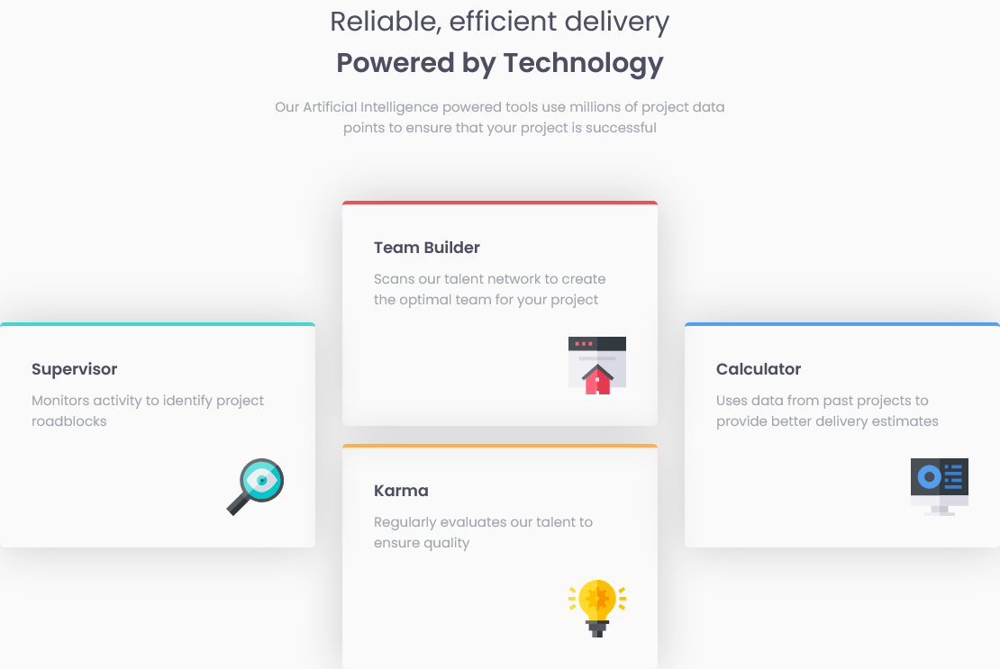

# Frontend Mentor - Four card feature section solution

This is a solution to the [Four card feature section challenge on Frontend Mentor](https://www.frontendmentor.io/challenges/four-card-feature-section-weK1eFYK). Frontend Mentor challenges help you improve your coding skills by building realistic projects.

## Table of contents

- [Overview](#overview)
  - [The challenge](#the-challenge)
  - [Screenshot](#screenshot)
  - [Links](#links)
- [My process](#my-process)
  - [Built with](#built-with)
  - [What I learned](#what-i-learned)
- [Author](#author)

## Overview

### The challenge

Users should be able to:

- View the optimal layout for the site depending on their device's screen size

### Screenshot



### Links

- [Solution URL](https://github.com/humbruno/humbruno.github.io/blob/931f9a95358cbc7e6af8b7a15e31b31c43096bd6/four-card-feature/index.html)
- [Live Site URL](https://humbruno.github.io/four-card-feature/index.html)

## My process

### Built with

- Semantic HTML5 markup
- CSS custom properties
- Flexbox
- Mobile-first workflow

### What I learned

Great project to help me plan out the layout and HTML structure ahead of styling anything, as it saved a lot of time in debugging why things are looking the way they're supposed to.

My approach as the create 3 divs which acted as columns on desktop, so that I could layout the cards in the way that they are, but I can't help but feel that there must but a different aproach to this that allows for more scalability in terms of number of cards.

It also limited the tablet layout, as I initially wanted to display 2 cards per row, but this column layout didn't allow for it.

```html
<section class="features">
  <div class="column1"></div>
  <div class="column2"></div>
  <div class="column3"></div>
</section>
```

## Author

- Frontend Mentor - [@humbruno](https://www.frontendmentor.io/profile/humbruno)
