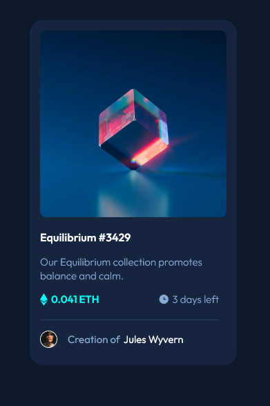

# Frontend Mentor - NFT preview card component solution

This is a solution to the [NFT preview card component challenge on Frontend Mentor](https://www.frontendmentor.io/challenges/nft-preview-card-component-SbdUL_w0U).

These challenges have really been putting me to the test. Although they may look simple, they really make you work for the solution to really nail the design.

## Table of contents

- [Overview](#overview)
  - [The challenge](#the-challenge)
  - [Screenshot](#screenshot)
- [My process](#my-process)
  - [Built with](#built-with)
  - [What I learned](#what-i-learned)
- [Author](#author)

## Overview

### The challenge

Users should be able to:

- View the optimal layout depending on their device's screen size
- See hover states for interactive elements

### Screenshot

### Links

- [Solution URL](https://github.com/humbruno/humbruno.github.io/blob/d571fdef98bba9df398d9cef31f7dbbc5e0f1cce/nft-card/index.html)
- [Live Site URL](https://humbruno.github.io/nft-card/index.html)

## My process

### Built with

- Semantic HTML5 markup
- CSS
- Flexbox

### What I learned

Where to begin?! Hands down the biggest challenge I faced with this one was the hover effect on the main image of the card. I ended up comming up with my own solution for this which was to add a span with `position: absolute` and `opacity: 0` right on top of the image, and then transition the opacity on hover.

Even though it works, I am not completely satisfied with it as it goes completely off-axis when the browser is zoomed in. Definitely a topic to learn more about for the next challenge!

This challenge also thought me about the importance of planning out the project and good-structured markup. Although it visually looks similarly to the proposed design, I felt that I had to constantly come up with workarounds to cover up the gaps in how I structured my markup.

## Author

- Frontend Mentor - [@humbruno](https://www.frontendmentor.io/profile/humbruno)
