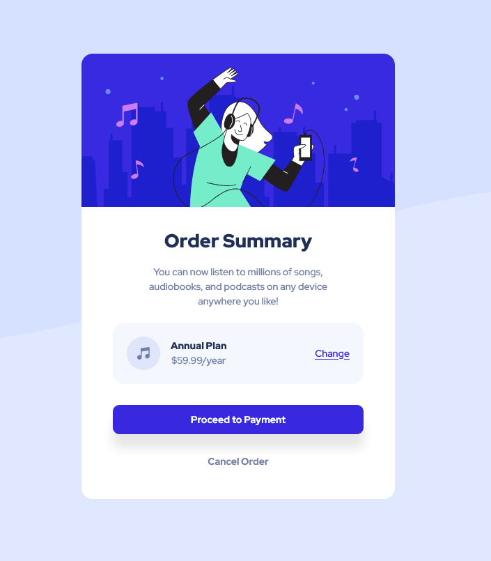

# Frontend Mentor - Order summary card solution

This is a solution to the [Order summary card challenge on Frontend Mentor](https://www.frontendmentor.io/challenges/order-summary-component-QlPmajDUj).

## Table of contents

- [Overview](#overview)
  - [The challenge](#the-challenge)
  - [Screenshot](#screenshot)
- [My process](#my-process)
  - [Built with](#built-with)
  - [What I learned](#what-i-learned)
- [Author](#author)

## Overview

### The challenge

Users should be able to:

- See hover states for interactive elements

### Screenshot

## My process

### Built with

- Semantic HTML5 markup
- CSS custom properties
- Flexbox
- Desktop-first workflow

### What I learned

This project was a great way to implement semantic HTML elements and more importantly, get into the habit of planning the markup and content structure before writing any CSS styling, having a well-structured HTML really make styling a lot easier.

It was also my first experience with media-queries, I found it hard finding what are the common max-width breakpoints so the content can scale with the viewport.

My biggest struggle was with the background, as when scaling the the viewport up & down, the background image start shifting upwards.

## Author

- Frontend Mentor - [@yourusername](https://www.frontendmentor.io/profile/humbruno)
