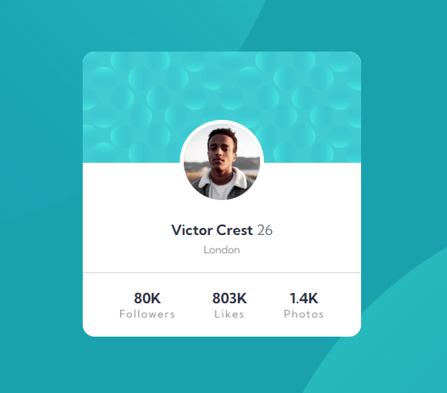

# Frontend Mentor - Profile card component solution

This is a solution to the [Profile card component challenge on Frontend Mentor](https://www.frontendmentor.io/challenges/profile-card-component-cfArpWshJ). Frontend Mentor challenges help you improve your coding skills by building realistic projects.

## Table of contents

- [Overview](#overview)
  - [The challenge](#the-challenge)
  - [Screenshot](#screenshot)
  - [Links](#links)
- [My process](#my-process)
  - [Built with](#built-with)
  - [What I learned](#what-i-learned)
- [Author](#author)

## Overview

### The challenge

- Build out the project to the designs provided

### Screenshot

### Links

- [Solution URL](https://github.com/humbruno/humbruno.github.io/blob/main/profile-card/index.html)
- [Live Site URL](https://humbruno.github.io/profile-card/index.html)

## My process

### Built with

- Semantic HTML5 markup
- CSS custom properties

### What I learned

Even though it was quite a straightforward design to accomplish, it definitely helped me understand the different ways to position and image on top of other elements.

After trying absolute positions, I came to the conclusion that setting a negative margin-top on the image was the approach that required less lines of code, which is something I like to think of for every design.

One thing that I haven't quite understood yet is that the background images have different color shades depending on the browser, even though I used an HSL color. For example, on Google Chrome it has a very teal accent, whereas in Firefox is leaning towards a light-blue, definitely something to learn more about.

## Author

- Frontend Mentor - [@humbruno](https://www.frontendmentor.io/profile/humbruno)
- Twitter - [@yourusername](https://www.twitter.com/yourusername)
