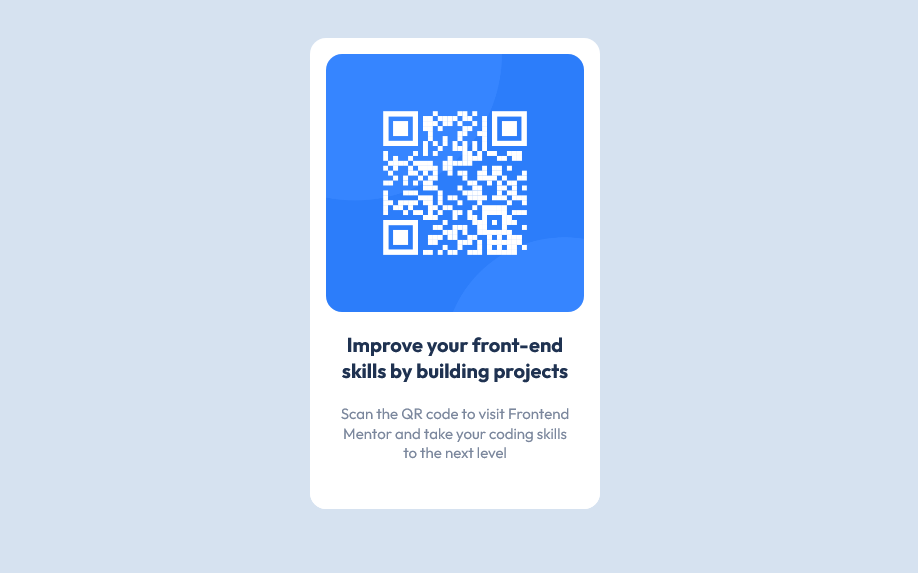

# Frontend Mentor - QR code component solution

This is a solution to the [QR code component challenge on Frontend Mentor](https://www.frontendmentor.io/challenges/qr-code-component-iux_sIO_H).

I love the Frontend Mentor challenges as they are a great way to help improve my coding skills by building realistic projects, taking the design side of things out of my mind so I can focus on the building side of things!

## Table of contents

- [Overview](#overview)
  - [Screenshot](#screenshot)
  - [Links](#links)
- [My process](#my-process)
  - [Built with](#built-with)
  - [What I learned](#what-i-learned)
  - [Useful resources](#useful-resources)
- [Author](#author)

## Overview

### Screenshot



### Links

- [Solution Markup](https://github.com/humbruno/humbruno.github.io/blob/1161209ec965cc87ea037b3ff8606e8efee3ab82/qrcode/index.html)
- [Live Solution URL](https://humbruno.github.io/qrcode/index.html)

## My process

### Built with

- HTML5 markup
- CSS
- Flexbox

### What I learned

One of my biggest takeaways from this challenge was how to center the card in the middle of the page, more specifically the vertical centering.

I knew from the get-go that using Flexbox would be a good way to center the object in the middle of the page, but no matter what I tried, the card always sat at the top edge of the screen.

After some researching, I found out that by applying a min-heigh of 100vh to the body could accomplish this (credits to Colt Steele!).

Truth be told, I don't fully understand why this was possible by setting the min-height to 100vh and I definitely have put this down as a topic of research and if there are any other alternatives to accomplish this effect in a page that contains a single item center at the middle of the screen.

This is the final code I ended up using on the body selector to align the card vertically and horizontally:

```css
body {
  display: flex;
  justify-content: center;
  align-items: center;
  min-height: 100vh;
}
```

This project was also a great to get into the habit of writing CSS variables for properties that I thought I would have to re-use throughout the code.

I applied this to the colors, and even though each color wasn't used more than once, I still believe it's a great habit to pick up early into my frontend development journey!

```css
:root {
  --white: hsl(0, 0%, 100%);
  --lightGray: hsl(212, 45%, 89%);
  --grayishBlue: hsl(220, 15%, 55%);
  --darkBlue: hsl(218, 44%, 22%);
}
```

### Useful resources

- Colt Steele - I have been periodically following one of his online courses and I happened to remember one of his videos of a similar concept (single item center in the middle of the screen) and how he applied a min-heigh property to the body to achieve this effect, definitely saved me a lot of headaches!
- [Coder Coder's beginner workflow setup](https://www.youtube.com/watch?v=aydFCQiUW44&t=311s) - Jessica's channel has been helpful in many ways as a beginner, but one of the biggest takeaways is how to setup projects from the start in a real-world scenario; This video helped me get into the habit of removing default margin and padding properties, setting up font family and box-sizing before I start writing any code, and make sure I have a clean slate!

## Author

- Frontend Mentor - [@humbruno](https://www.frontendmentor.io/profile/humbruno)
