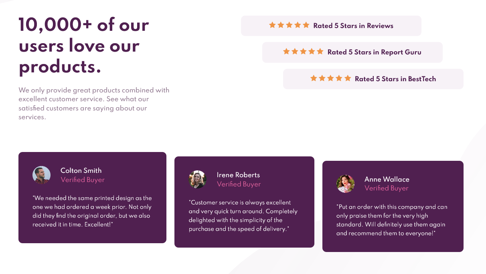

# Frontend Mentor - Social proof section solution

This is a solution to the [Social proof section challenge on Frontend Mentor](https://www.frontendmentor.io/challenges/social-proof-section-6e0qTv_bA). Frontend Mentor challenges help you improve your coding skills by building realistic projects.

## Table of contents

- [Overview](#overview)
  - [The challenge](#the-challenge)
  - [Screenshot](#screenshot)
  - [Links](#links)
- [My process](#my-process)
  - [Built with](#built-with)
  - [What I learned](#what-i-learned)
- [Author](#author)

**Note: Delete this note and update the table of contents based on what sections you keep.**

## Overview

### The challenge

Users should be able to:

- View the optimal layout for the section depending on their device's screen size

### Screenshot

### Links

- [Solution URL](https://github.com/humbruno/humbruno.github.io/blob/6979206ee919e3b3864f0737e52101fa59e24ec4/social-proof/index.html)
- [Live Site URL](https://humbruno.github.io/social-proof/index.html)

## My process

### Built with

- Semantic HTML5 markup
- CSS custom properties
- Flexbox
- Mobile-first workflow

### What I learned

With this project I got to put into practice some Flexbox modifier like `flex-grow` and `flex-shrink` as wel as alternative ways to position multiple background images on the body of the page.

I definitely need more practice with Flexbox, especially at the breakpoints where the content should transition between mobile-tablet and tablet-desktop

## Author

- Frontend Mentor - [@humbruno](https://www.frontendmentor.io/profile/humbruno)
